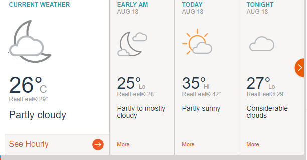

# MODERN_RAJASTHAN
DOC1-
</head>
   <link rel="stylesheet" href="style.css">
</head>
<?php
$conn = new mysqli('localhost', 'id1600548_kota', 'kotahack', 'id1600548_price');
if ($conn->connect_error) {
    die("Connection failed: " . $conn->connect_error);
} 
$q=$_REQUEST[q];
$sql = "SELECT * FROM list WHERE `id`=$q";
$result = $conn->query($sql);
if ($result->num_rows > 0) {
    while($row = $result->fetch_assoc()) {
    if ($row['status']==1)
{

       echo '
';
       
       echo '<h1 id=\'name\'>';
       echo $row['name'];
       echo '</h1>';
       echo '<h1 id=\'cost\'>';
       echo $row['cost'];
       echo '</h1>';
       echo '';
       echo '';
       echo '
';
}
  else
{
       echo '
';
      
 echo '<h1 id=\'name\'>';
       echo $row['name'];
       echo '</h1>';
       echo '<h1 id=\'cost\'>';
       echo $row['cost'];
       echo '</h1>';
       echo '';
       echo '';
       echo '
';
}
   
    }//while closes
echo '</table>';
} else {
    echo "0 results";
}
?>
DOC2-
</head>
   <link rel="stylesheet" href="style.css">
</head>
<?php
$conn = new mysqli('localhost', 'id1600548_kota', 'kotahack', 'id1600548_price');
if ($conn->connect_error) {
    die("Connection failed: " . $conn->connect_error);
} 
$q=$_REQUEST[q];
$sql = "SELECT * FROM scheme WHERE `id`=$q";
$result = $conn->query($sql);
if ($result->num_rows > 0) {
    while($row = $result->fetch_assoc()) {
echo '
';
echo '<h1 id=\'hea\'>';
echo $row['id'].').  '.$row['head'];
echo '</h1>';
echo '
';
echo $row['body'];
echo '
';
echo '
';
    }//while closes
echo '</table>';
} else {
    echo "0 results";
}
?>
INDEX-
<html>
</head>
  <link rel="stylesheet" href="style.css">
</head>
<body onload="startup()">

<h3>

महत्वपूर्ण जानकारी

-नए वोटर कार्ड बनाने वाले लोग या वोटर कार्ड में जानकारी संपादित करना चाहते हैं,
 एक अभियान उनके लिए सरकार स्कूल कोटा में 26/08/2017 को संगठित किया जाएगा।

-वित्तीय सहायता प्राप्त करने वाले सभी किसानों को पंचायत में पंजीकरण कराएं।
 या किसानों ने भी अमर किसान एपीपी में पंजीकरण करा सकता है

-MR.RAM उसके खेत में काम करने में कुछ लोगों को मदद करता है।
 संपर्क करें-8695864465

-25/08/2017 से NEREGA योजना गांव में सड़क निर्माण के लिए शुरू होगा। 

</h3>

</body>
</html>
